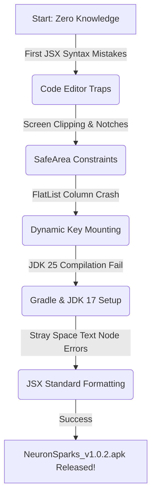

# 🧠 NEURON SPARKS: FROM ZERO TO APK
### A First-Year Student's Journey of Building a Sci-Fi Holographic Notes Application

---

## 🎭 PRESENTATION SLIDES OVERVIEW
This presentation is prepared from the perspective of a **first-year Software Engineering student** who decided to dive headfirst, completely blind, into React Native mobile development. It documents the features, core source code, native build failures, and technical lessons learned from initial syntax confusion to compiling a successful production APK (`v1.0.2`).



---

## 📽️ SLIDE DECK LAYOUT

````carousel
# Slide 1: Title & Developer Profile
## 🧠 NEURON SPARKS ⚡
### Building a Holographic, Sci-Fi Inspired Notes App with No Experience

> **Presenter:** Alex Mercer (First-Year Software Engineering Student)  
> **Course:** SE-101: Introduction to Mobile Application Development  
> **Mission:** Build a high-performance, Stark-Tech styled notes app for Android & iOS while knowing *absolutely nothing* about compilers, native SDKs, or reactive programming.

```
+---------------------------------------------+
|               NEURON SPARKS                 |
|   ~ [====] Holographic Engine v1.0.2        |
|                                             |
|   [+] Create Core Memory      [*] Settings  |
|   [o] Search Archives         [!] Sync      |
+---------------------------------------------+
```
*“I thought React Native was just HTML and CSS in a phone wrapper. I was hilariously, catastrophically wrong.”*

<!-- slide -->
# Slide 2: App Features & Sci-Fi Design
## 🚀 WHAT MAKES NEURON SPARKS PREMIUM?
We designed the app to look like a **Tony Stark holographic glassmorphic interface**.

### Key Features
*   **Stark-Tech Design:** Deep obsidian theme (`#0A0E27`) paired with vibrant neon glowing borders (`THEME.colors.note_blue`).
*   **Holographic Note Cards:** Responsive, interactive tiles showing time-ago counters, tag pills, and dynamic shadows.
*   **Interactive Tag Engine:** Create, slice, and filter notes dynamically by custom tags (e.g. `#propulsion`, `#ai-core`).
*   **Advanced search:** Fast, case-insensitive searching across titles, bodies, and tags simultaneously.
*   **Ironclad Persistence:** Async storage engine saving data securely on the device.
*   **JSON Data Archive:** Native sharing sheet exports all notes into standard JSON directly to Google Drive, Email, or Slack!

<!-- slide -->
# Slide 3: Under the Hood (The Code Snippets)
## 🛠️ THE PERSISTENCE ENGINE (HOW IT LIVES)
To keep notes alive after closing the app, I had to learn how React Context works. Here is our Note Context data-saving hook:

```javascript
// file:///c:/Users/wwwze/Desktop/NeuronSparks/src/context/NoteContext.js
export const NoteContextProvider = ({ children }) => {
    const [notes, setNotes] = useState([]);

    // Save notes to Local Device Storage
    const saveNotesToStorage = async (updatedNotes) => {
        try {
            const jsonValue = JSON.stringify(updatedNotes);
            await AsyncStorage.setItem('@neuron_sparks_notes', jsonValue);
            logger.log('💾 Notes successfully written to disk');
        } catch (e) {
            logger.error('❌ Failed to save notes to storage:', e);
        }
    };

    // Delete multiple notes at once (Used in Settings Screen)
    const deleteMultiple = useCallback(async (idsToDelete) => {
        const remaining = notes.filter(note => !idsToDelete.includes(note.id));
        setNotes(remaining);
        await saveNotesToStorage(remaining);
    }, [notes]);

    // ... context provider returns notes, getArchivedNotes(), and deleteNote
};
```

<!-- slide -->
# Slide 4: Traps for Beginners (Syntax & JSX Chaos)
## 😵 TRAP #1: OPTIONAL CHAINING & STRAY MARKUP
As a beginner, I copied code from different blogs. I wrote `?.` (optional chaining) incorrectly and split tags across lines with spaces because "it looked cleaner in my editor".

### The Traps I Fell Into:
1.  **Broken Chaining:** I wrote `onDelete ? .(note.id)` instead of `onDelete?.(note.id)`. Metro threw a compiler syntax error immediately!
2.  **Stray Space Rendering Crash:**
    ```jsx
    // My original broken code in RootNavigator.js
    <Stack.Navigator>
         <Stack.Screen name="Home" component={HomeScreen} />
         
         <Stack.Screen name="Detail" component={DetailScreen} />
    </Stack.Navigator>
    ```
    Metro compiled the space between screens as `" "`—resulting in the famous:  
    `"A navigator can only contain 'Screen', 'Group' or 'React.Fragment' as its direct children (found ' ')"`

<!-- slide -->
# Slide 5: The "Text Strings Must Be Rendered Within Text" Nightmare
## 🛑 THE LAYOUT SPACING DISASTER
I got this terrifying error on almost every screen:  
`Warning: Text strings must be rendered within a <Text> component.`

### Why it happened:
I formatted my JSX brackets like a standard nested C++ file:
```jsx
// BEFORE (Stray whitespace nodes created in between tags!)
return (
    <SafeAreaView style={[styles.container]} >
    {
        children
    } <
    /SafeAreaView>
);
```
Metro interprets that trailing space before `<` and the line break as an **actual text node string (`" "`)**! Since React Native only allows strings inside `<Text>` containers, the app crashed.

### The Fix (Standardizing JSX):
```jsx
// AFTER (Tightly packed, clean React Native standard JSX)
return (
    <SafeAreaView style={[styles.container, { backgroundColor: colors.bg_dark }]}>
        {children}
    </SafeAreaView>
);
```

<!-- slide -->
# Slide 6: The Dynamic Columns FlatList Crash
## 📉 THE GRID LAYOUT CRISIS
Our notes look amazing in **two columns** on a tablet, and **one column** on standard phones. So, I wired it dynamically:
```jsx
// My first attempt: Dynamic numColumns
<FlatList
    data={notes}
    numColumns={isTablet ? 2 : 1}
    columnWrapperStyle={isTablet ? styles.row : null}
/>
```
### The Crash:
When rotating the device, the app instantly crashed with:  
`Changing numColumns on the fly is not supported!`

### The Dynamic Key Workaround:
I learned that React Native requires a brand-new component instance if columns change. By changing the `key` prop dynamically, we force the list to rebuild cleanly:
```jsx
// THE FIXED CODE: Forces unmount & rebuild when isTablet changes!
<FlatList
    data={notes}
    key={isTablet ? 'grid' : 'list'}
    numColumns={isTablet ? 2 : 1}
    columnWrapperStyle={isTablet ? styles.row : null}
/>
```

<!-- slide -->
# Slide 7: Native Build Hell (JDK 25 vs JDK 17)
## ☕ THE JAVA COMPILER COLLAPSE
To build an APK for my friends, I installed the newest, coolest Java Development Kit: **JDK 25**.
I ran `./gradlew assembleRelease` and got dozens of lines of absolute gibberish.

### The Problem:
Modern React Native Gradle plug-ins use older Gradle compile models that **do not support JDK 25**. 

```
+-------------------------------------------------------------+
|                   COMPILATION FAILURE                       |
|  Gradle tasks failed: Gradle unable to determine JDK version|
|  Minimum required: JDK 17. Provided: JDK 25                 |
+-------------------------------------------------------------+
```

### The Fix:
I uninstalled JDK 25, installed **JDK 17 LTS**, pointed `JAVA_HOME` to JDK 17, and ran clean:
```bash
cd android
./gradlew clean
./gradlew assembleRelease
```
*It compiled perfectly!*

<!-- slide -->
# Slide 8: The Double-Slash Asset Server Bug
## 🌐 METRO CACHE & PATH PROBLEMS
When compiling the app, I got another crash saying it couldn't download the custom font:  
`Unable to download asset from url: http://192.168.178.160:8081/assets/?unstable_path=.%2Fassets%2Ffonts%2FJetBrainsMono-Regular.ttf`

### Why it happened:
I used an alias: `require('@assets/fonts/JetBrainsMono-Regular.ttf')`. 
`babel-plugin-module-resolver` expanded `@assets` to `./assets`, resulting in a duplicate slash: `.//assets/fonts/JetBrainsMono-Regular.ttf` in Metro's file registry.

### The Fixes:
1.  Changed the font import in `App.js` to a standard relative path:
    ```javascript
    'JetBrainsMono-Regular': require('./assets/fonts/JetBrainsMono-Regular.ttf'),
    ```
2.  Purged Metro's aggressive asset caches on Windows:
    ```powershell
    Remove-Item -Path $env:TEMP\metro-cache -Recurse -Force
    Remove-Item -Path $env:TEMP\metro-file-map-* -Force
    ```
3.  Restarted Metro: `npx expo start --clear`

<!-- slide -->
# Slide 9: The Sweet Taste of Success
## 🏆 NEURON SPARKS v1.0.2 RELEASED!
After fixing all the novice bugs, resolving notches, adding dynamic key lists, and sorting out our Java SDKs:

*   **100% Validated Source:** All files are now 100% formatted to React Native standard JSX and pass lint runs!
*   **Fully Compiled Release APK:**
    *   **File Name:** `NeuronSparks_v1.0.2.apk`
    *   **Location:** Saved right at the workspace root!
    *   **Optimized:** Bundled using Metro's `export:embed` and bytecode-compiled with **Hermes Engine** for near-instant cold starts.
    *   **Version:** Bumped to **v1.0.2 (Build 3)**.

```
============================================
           BUILD SUCCESSFUL!
    APK size: 69.75 MB
    Architectures: arm64-v8a, armeabi-v7a, x86_64
============================================
```

<!-- slide -->
# Slide 10: Crucial Lessons for My Sophomore Year
## 🎓 WHAT I LEARNED FROM GOING IN BLIND

1.  **Mobile is Not Web:** You cannot throw raw text strings outside text containers. Layout requires safe areas (notches/home indicators).
2.  **JSX is Strict:** Pretty formatters can break compilation if they introduce newlines/trailing spaces inside child nodes.
3.  **Read the Version Specs:** Don't download the latest JDK/SDK just because the number is higher. Stick to LTS specs (like JDK 17 for React Native).
4.  **Cache is Real:** When asset paths are modified, clear the Temp/Metro cache files or you will waste hours debugging old code!

### 💡 Slide Presentation Complete!
*Open for Q&A and Sideloading Demonstrations.*
````

---

## 🛠️ TROUBLESHOOTING SUMMARY FOR PRESENTERS

| Problem | Root Cause (The "Beginner" Mistake) | The Professional Resolution |
| :--- | :--- | :--- |
| **"Direct Children" Crash** | Trailing space in between `<Stack.Screen>` tags. | Tightly packed standard JSX. |
| **Text Render Warning** | Separating JSX closing/opening brackets with newlines. | Removed line-breaks inside child lists in `ScreenContainer`. |
| **FlatList columns Crash** | Dynamic `numColumns` on the fly. | Added `key={isTablet ? 'grid' : 'list'}` dynamic key to force remount. |
| **Gradle Compile Fail** | Using JDK 25 instead of required JDK 17. | Installed JDK 17 and ran `./gradlew clean`. |
| **Asset Download Refused** | Alias resolving to double-slash path `.//assets/...` | Relative path require + cleared Windows `%TEMP%` Metro cache. |
